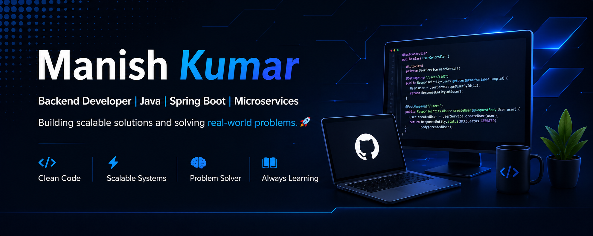

<!-- 🔷 Banner -->

  

---

## 👋 Hi there, I'm Manish Kumar!
💻 I'm a Backend Developer with 2+ years of experience in building high-scale distributed systems using **Java, Spring Boot, and Apache Kafka**. I love turning ideas into robust, efficient, and impactful solutions.

## When I code, I rely on

  
  
  
  

  
  
  
  

  
  
  

  
  
  
  
  

  
  
  

## 🏆 Achievements

  
  
  

## Let's Connect!

